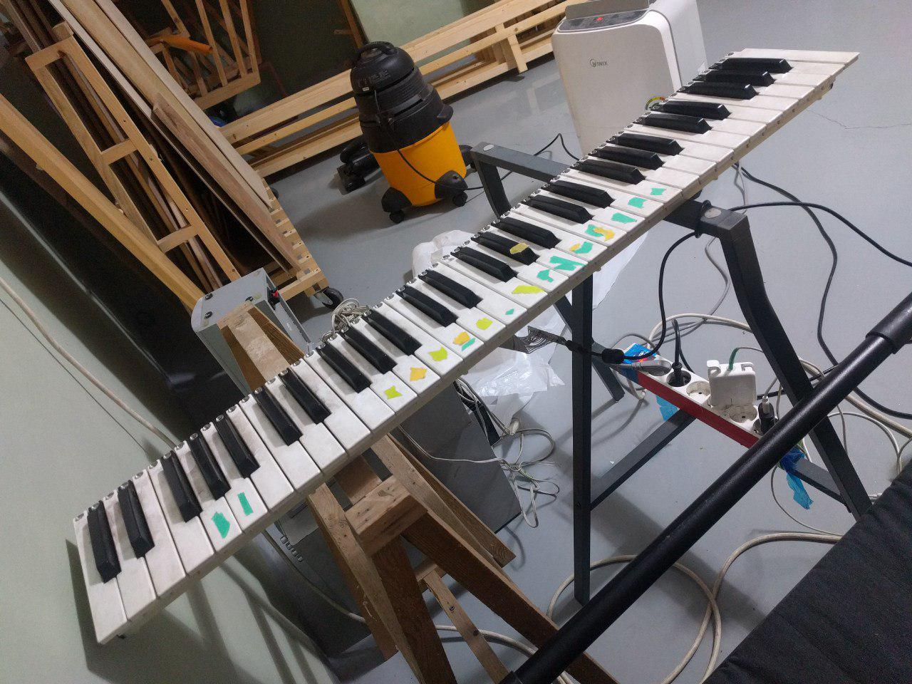
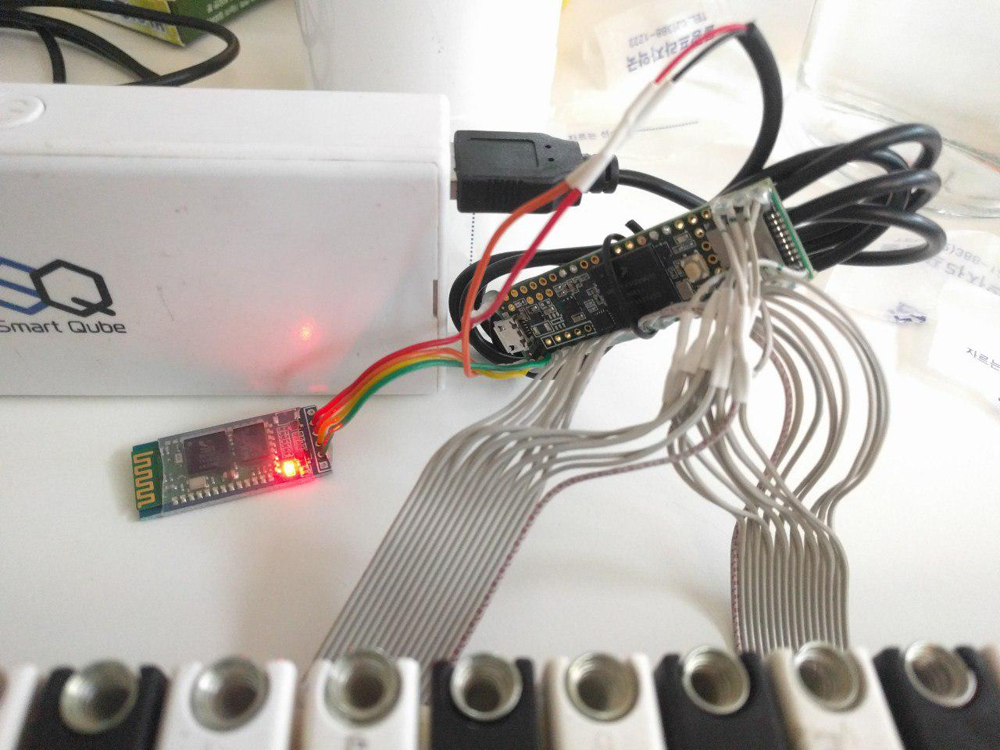
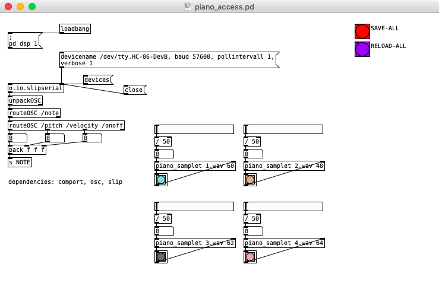
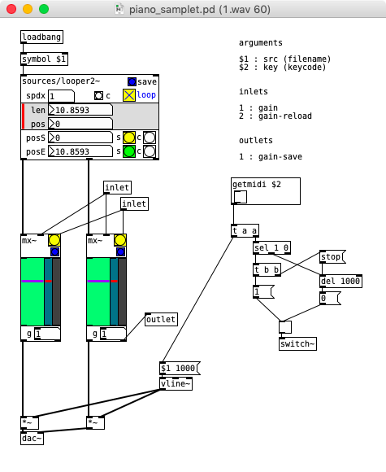
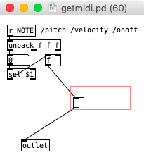

# midi_keyboard

- a hackable midi master keyboard

- the principles
  - http://blog.komar.be/how-to-make-a-keyboard-the-matrix/

- old 'Miditech MIDIPLUS-61'
  

- only using the 'keybed' + teensy 3.5
  

- no velocity support, but you can find relative info.
  - https://github.com/ast/keyboard/blob/master/README.md
  - https://github.com/ast/keyboard/issues/1

- OSC over Serial added, and transmitting Serial over Bluetooth w/ HC-06
  

- connecting PD patch added, depends on 'osc', 'comport', 'slip' etc..
  
  
  
