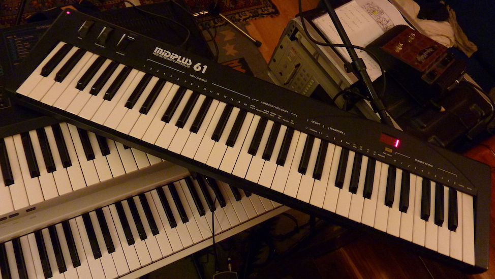

# midi_keyboard

- a hackable midi master keyboard

- studied principles & examples & repos

 - https://github.com/ast/keyboard/blob/master/README.md
 - http://blog.komar.be/how-to-make-a-keyboard-the-matrix/

- took a keybed from old 'Miditech MIDIPLUS-61'

  

- teensy 3.5
